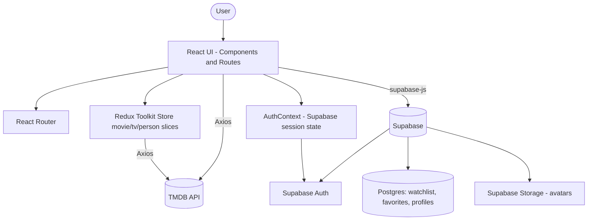
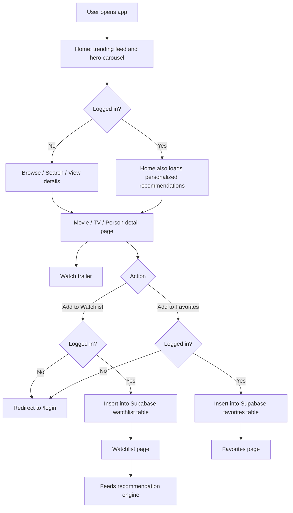

# 🎬 NEXA — Personalized Movie & TV Discovery Platform

NEXA is a React-based movie and TV discovery app that combines live data from **TMDB** with **Supabase**-backed authentication and user profiles to deliver a personalized watchlist, favorites list, and a rule-based recommendation feed built from each user's own viewing interests.

[](https://react.dev/)
[](https://vitejs.dev/)
[](https://redux-toolkit.js.org/)
[](https://supabase.com/)
[](https://tailwindcss.com/)
[](https://www.themoviedb.org/documentation/api)

**🔗 Live Demo:** [movie-app-aiap.vercel.app](https://movie-app-aiap.vercel.app/)
**📦 Repository:** [github.com/sandipkumarjha/MovieApp](https://github.com/sandipkumarjha/MovieApp)

---

## Overview

NEXA lets users browse trending and popular movies/TV shows, search across titles and people, and view rich detail pages with trailers, cast/crew links, genres, and streaming providers. Once a user creates an account (via Supabase Auth), the app unlocks a **watchlist**, **favorites list**, a **customizable profile** (username + avatar), and a **"Recommended For You"** feed generated from the movies the user has saved.

It's built as a practical, full-stack-adjacent frontend project: a single-page React app that talks directly to a third-party content API (TMDB) for catalog data and to Supabase for everything user-specific (auth, watchlist, favorites, profile, avatar storage).

**Target users:** movie/TV enthusiasts who want a fast, clean discovery experience and a personal watchlist that follows them across sessions — without needing a heavyweight streaming-platform account.

---

## Key Features

- 🔐 **Authentication** — Email/password sign-up and login via Supabase Auth, with session persistence and protected routes for logged-in-only pages
- 🔥 **Trending & Popular Discovery** — Daily trending feed (movies/TV/all) and category-filterable popular lists (popular, top rated, now playing / on the air, upcoming / airing today) with infinite scroll
- 🔎 **Live Multi-Search** — Debounced search across movies, TV shows, and people with an inline results dropdown
- 🎞️ **Detailed Title Pages** — Ratings, genres, runtime, release date, overview, IMDb link, official homepage link, and watch providers
- ▶️ **In-App Trailer Playback** — YouTube trailer embedded in a modal overlay
- 📌 **Personal Watchlist** — Save/remove movies and TV shows, stored per-user in Supabase
- ❤️ **Favorites** — Separate favorites list with add/remove, stored per-user in Supabase
- 🧠 **Personalized Recommendations** — A rule-based "Recommended For You" feed generated from the user's own watchlist (see [Recommendation Workflow](#personalized-recommendation-workflow) below)
- 👤 **User Profiles** — Editable username and avatar image upload (stored in Supabase Storage)
- 🎭 **People Directory** — Browse popular actors/crew with dedicated detail pages
- 📱 **Fully Responsive UI** — Collapsible sidebar navigation, mobile-first layouts throughout

---

## Technology Stack

| Category | Technologies |
|---|---|
| **Frontend** | React 19, React Router DOM 7, Tailwind CSS 3 |
| **State Management** | Redux Toolkit + React-Redux (movie/TV/person catalog state), React Context (`AuthContext`) for auth state |
| **Backend / Cloud Services** | Supabase (Auth, Postgres database, Storage for avatars) |
| **Database** | Supabase Postgres (`watchlist`, `favorites`, `profiles` tables) |
| **External API** | TMDB (The Movie Database) API — via Axios |
| **Other Libraries** | Axios, react-infinite-scroll-component |
| **Deployment** | Vercel |
| **Development Tools** | Vite 8, ESLint 9 |

---

## System Architecture



---

## Application Workflow



Step by step:
1. **Home** loads a random hero wallpaper and the daily trending list from TMDB, filterable by movies / TV / all.
2. **Discovery pages** (`/movie`, `/tv`, `/person`) load category-filtered, infinite-scrolling lists from TMDB.
3. **Search** (in the top nav) debounces user input and queries TMDB's multi-search endpoint for movies, TV shows, and people.
4. **Detail pages** fetch title info, external IDs, recommendations, similar titles, videos, and watch providers in parallel, then render a trailer button, an "Add to Watchlist" button, and an "Add to Favorites" toggle.
5. **Authentication** — unauthenticated users are redirected to `/login` when attempting a watchlist/favorite action or visiting a protected route (`/watchlist`, `/favorites`, `/profile`).
6. **Watchlist/Favorites** are stored as rows in Supabase, scoped by `user_id`, and rendered as a responsive grid with a remove action.
7. **Recommendations** are computed client-side on the Home page whenever a logged-in user has watchlist entries (see below).
8. **Profile** lets the user set a username and upload/replace an avatar (max 2MB image), persisted to Supabase Storage and the `profiles` table.

---

## Personalized Recommendation Workflow

The recommendation engine is **rule-based**, computed entirely on the client from the logged-in user's own watchlist — it is **not** machine learning or AI-driven.

1. **Watchlist retrieval** — On the Home page, if a user is logged in, their `movie`-type watchlist rows are fetched from Supabase, ordered by most recently added.
2. **Source selection** — The 3 most recently added movies from the watchlist are used as the "seed" titles.
3. **TMDB recommendations** — For each seed movie, TMDB's `/movie/{id}/recommendations` endpoint is called in parallel.
4. **Combining results** — All returned recommendation lists are flattened into a single pool.
5. **Scoring by frequency** — Each recommended movie's `id` is counted across the seed results; a movie recommended by more than one seed movie scores higher.
6. **Excluding watchlisted movies** — Any movie already present in the user's watchlist is filtered out of the candidate pool.
7. **De-duplication** — Candidates are reduced to unique movies by `id` (via a `Map`).
8. **Final ranking** — A final score is calculated as `(recommendation frequency x 10) + TMDB vote average`, so how often a movie is recommended across seeds weighs more heavily than its raw rating.
9. **Result set** — Candidates are sorted by final score, descending, and the top 12 are shown in a "Recommended For You" row.

If the user isn't logged in, or has no movies in their watchlist yet, the section prompts them to add movies to get recommendations.

---

## Project Folder Structure

```
MovieApp/
├── public/
│   ├── favicon.svg
│   ├── icons.svg
│   ├── loader.mp4
│   └── noimage.webp
├── src/
│   ├── assets/                 # Static images (hero, logos)
│   ├── components/
│   │   ├── auth/
│   │   │   ├── Login.jsx
│   │   │   ├── Signup.jsx
│   │   │   └── ProtectedRoute.jsx
│   │   ├── templates/
│   │   │   ├── Cards.jsx           # Grid card layout (movie/tv/person)
│   │   │   ├── HorizontalCards.jsx # Horizontal scroll row
│   │   │   ├── Header.jsx          # Hero carousel
│   │   │   ├── DropDown.jsx
│   │   │   ├── PageHeader.jsx
│   │   │   ├── Sidenav.jsx         # Sidebar navigation
│   │   │   ├── TopNav.jsx          # Search + auth controls
│   │   │   └── Trailer.jsx         # Trailer modal
│   │   ├── Home.jsx             # Trending + recommendations
│   │   ├── Trending.jsx / Popular.jsx / Movie.jsx / TVshow.jsx / People.jsx
│   │   ├── Moviedetails.jsx / Tvdetails.jsx / Persondetails.jsx
│   │   ├── Watchlist.jsx
│   │   ├── Favorites.jsx
│   │   ├── Profile.jsx
│   │   └── Loading.jsx
│   ├── context/
│   │   └── AuthContext.jsx      # Supabase session provider
│   ├── hooks/
│   │   └── useAuth.js
│   ├── lib/
│   │   └── supabase.js          # Supabase client init
│   ├── utils/
│   │   ├── axios.jsx            # TMDB Axios instance
│   │   └── recommendations.js   # TMDB recommendation fetch helper
│   ├── App.jsx                  # Route definitions
│   └── main.jsx                 # App entry point (Redux + Router + Auth providers)
├── store/
│   ├── actions/                 # MovieAction, TvAction, PersonAction
│   ├── reducers/                # MovieSlice, tvSlice, PersonSlice
│   └── store.jsx                # Redux store config
├── index.html
├── package.json
├── vite.config.js
├── tailwind.config.js
└── postcss.config.js
```

| Path | Purpose |
|---|---|
| `src/lib/supabase.js` | Initializes the Supabase client using environment variables |
| `src/context/AuthContext.jsx` | Tracks the current Supabase session and exposes `user`, `loading`, `logout` |
| `src/components/auth/ProtectedRoute.jsx` | Redirects unauthenticated users to `/login` |
| `src/utils/axios.jsx` | Pre-configured Axios instance for the TMDB API |
| `store/store.jsx` | Combines `movie`, `tv`, and `person` Redux slices |
| `store/actions/*Action.jsx` | Async thunks that fetch title details, external IDs, videos, similar/recommended titles, and watch providers in parallel |

---

## Core Modules

- **Authentication** (`context/AuthContext.jsx`, `hooks/useAuth.js`, `components/auth/*`) — sign-up, login, logout, session tracking, and route protection via Supabase Auth
- **Movie/TV Discovery** (`Home.jsx`, `Trending.jsx`, `Popular.jsx`, `Movie.jsx`, `TVshow.jsx`) — category-filtered, infinite-scrolling catalog browsing
- **Search** (`templates/TopNav.jsx`) — debounced multi-search across movies, TV, and people
- **Movie/TV Details** (`Moviedetails.jsx`, `Tvdetails.jsx`) — parallel data fetching for detail, external IDs, recommendations, similar titles, videos, and watch providers
- **Watchlist** (`Watchlist.jsx`) — per-user saved titles, backed by the Supabase `watchlist` table
- **Favorites** (`Favorites.jsx`) — per-user favorited titles, backed by the Supabase `favorites` table
- **User Profile** (`Profile.jsx`) — username editing and avatar upload via Supabase Storage
- **Recommendations** (`utils/recommendations.js`, logic in `Home.jsx`) — the rule-based scoring engine described above
- **API Integration** (`utils/axios.jsx`, `store/actions/*`) — TMDB request layer
- **State Management** (`store/`) — Redux Toolkit slices for movie/TV/person detail state; React Context for auth state

---

## Database and Security

The app uses **Supabase** for authentication, data storage, and file storage. Based on the queries used in the codebase, the following tables are confirmed:

| Table | Confirmed columns (from code) | Purpose |
|---|---|---|
| `watchlist` | `id`, `user_id`, `movie_id`, `title`, `poster_path`, `media_type`, `created_at` | Stores each user's saved movies/TV shows |
| `favorites` | `id`, `user_id`, `movie_id`, `title`, `poster_path`, `media_type`, `created_at` | Stores each user's favorited movies/TV shows |
| `profiles` | `id`, `username`, `email`, `avatar_url`, `created_at` | Stores per-user profile data, keyed by the Supabase Auth `user.id` |

- **Authentication** — handled entirely by Supabase Auth (`supabase.auth.signUp`, `signInWithPassword`, `signOut`, `onAuthStateChange`); email confirmation is required after sign-up.
- **Storage** — an `avatars` storage bucket holds one avatar file per user at `{user_id}/avatar.{ext}`, uploaded with `upsert: true` so re-uploads replace the existing file; a public URL is then saved to `profiles.avatar_url`.
- **User-specific data** — every watchlist/favorites query filters by `user_id` (and `profiles` by `id`), so data access is scoped per authenticated user at the query level.
- **Row Level Security** — RLS policies are not present in this repository (no SQL/migration files were found), so they can't be verified from the code. If RLS isn't already enabled on `watchlist`, `favorites`, and `profiles` in the Supabase dashboard, that should be treated as a priority before going to production.

No credentials, keys, or tokens are included in this document.

---


## Installation and Local Setup

### Prerequisites
- Node.js (LTS recommended)
- npm
- A Supabase project (for Auth, database, and Storage)
- A TMDB API access token

### Steps

```bash
# 1. Clone the repository
git clone https://github.com/sandipkumarjha/MovieApp.git
cd MovieApp

# 2. Install dependencies
npm install

# 3. Configure environment variables
# Create a .env file in the project root (see below)

# 4. Start the development server
npm run dev

# 5. Build for production
npm run build

# 6. Preview the production build
npm run preview
```

> **Note:** In the current codebase, the TMDB API bearer token is hard-coded in `src/utils/axios.jsx` rather than read from an environment variable. If you fork or deploy this project, move it into a `VITE_TMDB_*` environment variable before publishing your own token.

---

## Environment Variables

Create a `.env` file in the project root:

```env
VITE_SUPABASE_URL=your_supabase_project_url
VITE_SUPABASE_PUBLISHABLE_KEY=your_supabase_publishable_key
```

| Variable | Used for |
|---|---|
| `VITE_SUPABASE_URL` | Supabase project URL (client initialization) |
| `VITE_SUPABASE_PUBLISHABLE_KEY` | Supabase publishable/anon key (client initialization) |

No actual credentials are included above — replace the placeholders with your own project's values.

---

## Engineering Highlights

- Parallelized data fetching (`Promise.all`) for movie/TV detail pages to load detail, external IDs, recommendations, similar titles, videos, and watch providers concurrently
- Client-side rule-based recommendation scoring combining recommendation frequency and TMDB rating
- Debounced search input to avoid firing a TMDB request on every keystroke
- Route protection pattern via a reusable `ProtectedRoute` wrapper component
- Supabase session syncing through `onAuthStateChange`, kept in a React Context and consumed via a `useAuth` hook
- Per-user data scoping on every Supabase read/write (`user_id` filters)
- Responsive, mobile-first layout with a collapsible sidebar and a mobile hamburger menu
- Infinite scroll for catalog pages (movies, TV shows, people) via `react-infinite-scroll-component`

---

## Challenges and Solutions

1. **Combining catalog data (TMDB) with user data (Supabase) on the same page** — Solved by keeping TMDB-sourced state in Redux slices and Supabase-sourced state (auth, watchlist, favorites) in React Context/local component state, fetched independently and merged in the UI layer (e.g., `Home.jsx` combines trending TMDB data with a Supabase-derived recommendation list).
2. **Avoiding duplicate/irrelevant recommendations** — The recommendation logic explicitly de-duplicates by movie `id` using a `Map` and filters out anything already present in the user's watchlist before scoring.
3. **Preventing flicker/incorrect redirects while checking auth state** — `ProtectedRoute` and pages like `Watchlist.jsx`/`Favorites.jsx` wait on an explicit `loading` flag from `AuthContext` before deciding whether to redirect to `/login`, avoiding a false "not logged in" redirect during the initial session check.
4. **Global scroll being disabled** — An in-code comment in `index.css` notes that a global `overflow: hidden` was previously breaking page scrolling; it was removed in favor of each route managing its own scroll container (e.g., the `id="tv-scroll"` / `id="people-scroll"` containers used with infinite scroll).
5. **Avatar re-uploads** — Handled by writing each user's avatar to a fixed path (`{user_id}/avatar.{ext}`) with `upsert: true`, so re-uploading replaces the previous file instead of accumulating orphaned files.

---

## Future Improvements

*The following are planned/potential enhancements — not yet implemented:*

- Move the TMDB API token out of source code and into an environment variable
- Extend personalized recommendations to also factor in favorites, not just the watchlist
- Add Row Level Security (RLS) policies for `watchlist`, `favorites`, and `profiles` if not already configured in Supabase
- TV show watchlist/favorites support in the recommendation engine (currently movie-only)
- User reviews and ratings
- Dark/Light theme toggle
- Progressive Web App (PWA) support

---

## Learning Outcomes

Building NEXA involved practical work across several areas of frontend and full-stack development: structuring a multi-page React application with client-side routing, managing catalog data with Redux Toolkit alongside authentication state in React Context, integrating a third-party REST API (TMDB) with parallelized requests, designing a Supabase schema for per-user data (watchlist, favorites, profiles) with storage-backed file uploads, and implementing a rule-based recommendation algorithm from first principles rather than a pre-built library. It also involved hands-on experience with responsive, mobile-first UI design using Tailwind CSS.

---

## License

No license file is currently included in this repository. Add a `LICENSE` file (e.g., MIT) if you intend to open-source this project, or mark it as proprietary/all-rights-reserved.

---

## Author

**Sandip Kumar Jha**
GitHub: [@sandipkumarjha](https://github.com/sandipkumarjha)

Built as a practical project focused on API integration, Supabase-backed authentication and data modeling, state management, and responsive React development.
